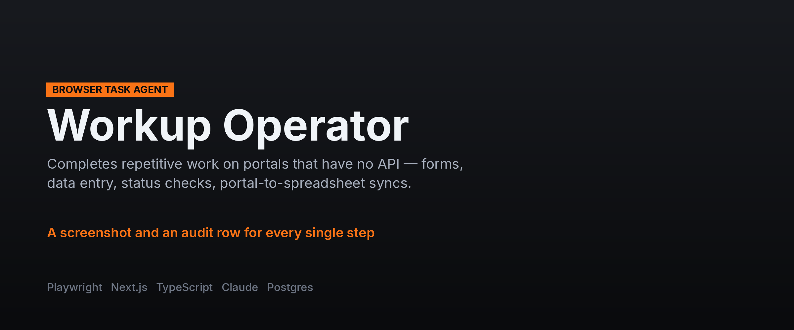
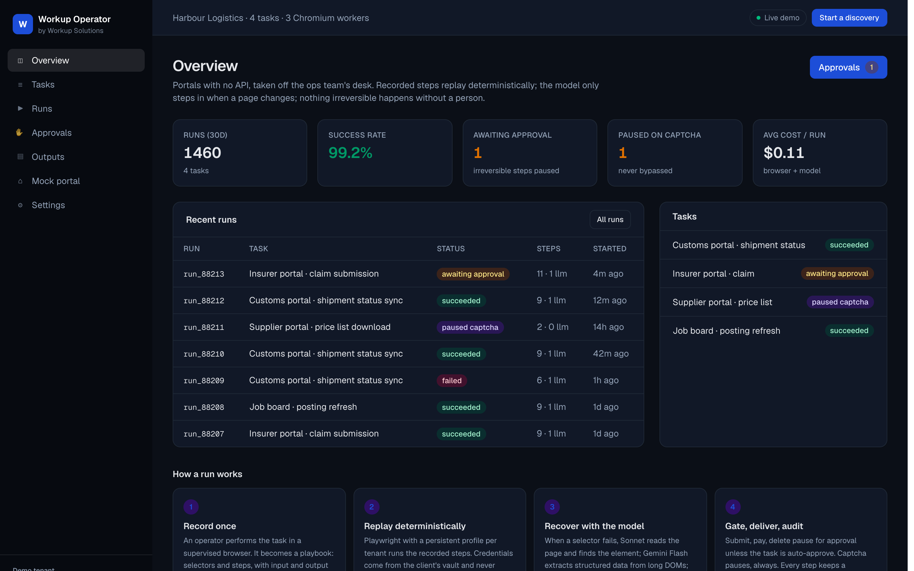

**[← All systems](https://github.com/musabqazi)** · [Voice Receptionist](https://github.com/musabqazi/voice-receptionist) · [Outbound Engine](https://github.com/musabqazi/outbound-engine) · [WhatsApp Agent](https://github.com/musabqazi/whatsapp-agent)

# Browser Operator — browser task agent

Completes repetitive tasks on websites and portals that have no API: form submissions, data
entry, status checks, downloads, portal-to-spreadsheet syncs. Runs on a schedule or on demand,
with a screenshot and an audit row for every step, and a human approval gate before anything
irreversible.

queue, CSV export, and a public mock portal (login `demo` / `demo`). **Spec:** [SPEC.md](SPEC.md)

🟢 **Live demo:** https://workup-operator.vercel.app · **Source:** private, available on request

## Dashboard

Task runs with a screenshot and an audit row for every step, and an approval gate before anything irreversible.

## The problem

A person spends hours a week clicking through the same government, insurer, supplier or logistics
portal. Nobody will ever build an API for it.

## What it does

1. **Record once.** An operator performs the task in a supervised browser; it becomes a playbook of
   selectors and steps with an input schema and an output schema.
2. **Replay deterministically.** Playwright with a persistent profile per tenant. Credentials come
   from the client's vault (1Password Connect / Vault / Supabase Vault) and never appear in logs
   or screenshots. MFA via TOTP secrets or a human prompt.
3. **Recover with the model.** When a selector fails, Claude Sonnet reads the page and finds the
   element; Gemini Flash extracts structured data from long DOMs; Haiku verifies each step. The
   playbook is patched so the next run is deterministic again.
4. **Gate, deliver, audit.** Submit / pay / delete pause for approval unless the task is
   `auto_approve`. Captcha pauses, always — never bypassed. Outputs go to CSV, webhook or sheet;
   every step keeps a screenshot and a DOM hash.

## Stack

    

## A note on what you can see here

The live demo runs on **seeded demo data** — a fictional tenant and synthetic records throughout. No client data appears in the demo or in this repository, and the implementation is private.

---
Part of the <a href="https://github.com/musabqazi">musabqazi portfolio</a> · source private. © 2026 Musab Qazi
